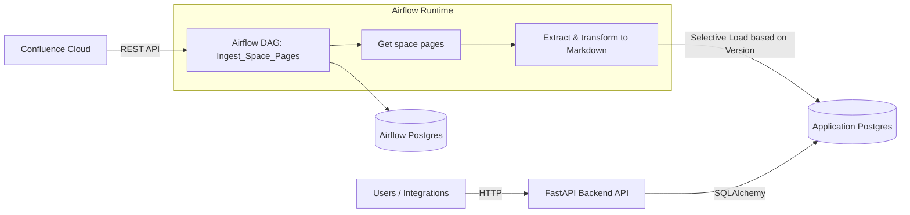

# Confluence RAG

## High-level Architecture
This project ingests Confluence content and exposes it for downstream applications via a simple backend API. At a glance:
- Airflow orchestrates the ingestion pipeline: discovering pages in specified Confluence spaces, extracting content, converting it to Markdown, and loading it selectively into the application database based on version changes.
- Two Postgres instances are used: one for Airflow's own metadata and one for the application data (ingested pages).
- A FastAPI backend provides a thin API layer on top of the application database. Alembic ensures DB schema migrations run on startup.
- Everything is containerized and wired together via Docker Compose.



Key data flow:
- Confluence -> Airflow: Page metadata and HTML content fetched via REST.
- Airflow -> App DB: Only new/updated pages inserted (checked by page version).
- Backend API -> Clients: Read-only access to stored pages and healthchecks.

## Services Description & Availability

| **Service**                       | **Port**    |
|-----------------------------------|-------------|
| Airflow UI                        | 8080        |
| Airflow Backend DB (Postgres)     | Not Exposed |
| Application Backend DB (Postgres) | 5432        |
| Application API (FastAPI)         | 8005        |


The Airflow logs as well as the Postgres database data are managed using named
volumes to persist them across restarts and upgrades.
Named volumes are better for runtime-generated data,
where you do not need direct access to raw files on the host.
They abstract the data storage away from the file system and
provide more portability (e.g., moving services between hosts).

## Setup
We use a single, global, environment variables file called `.env` which should be located on the root-level of 
the project. 
A template file `.env.template` is provided to showcase the expected variables which should be provided. With the
environment variables set up, you can run
```sh
docker-compose up
```
to start-up the container.

### Initial Airflow User
On first start, a default Airflow user is created with username `admin` and password `admin`.

### Backend API Migrations
Migrations are automatically executed on start-up of the backend service. You can
manually execute migrations inside the docker container by running
```sh
docker exec -it <container_name> alembic <command>
```
